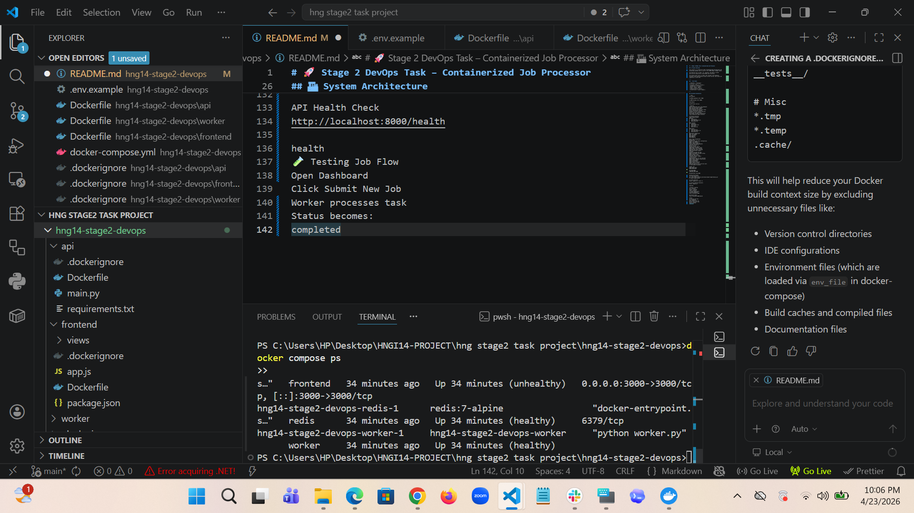
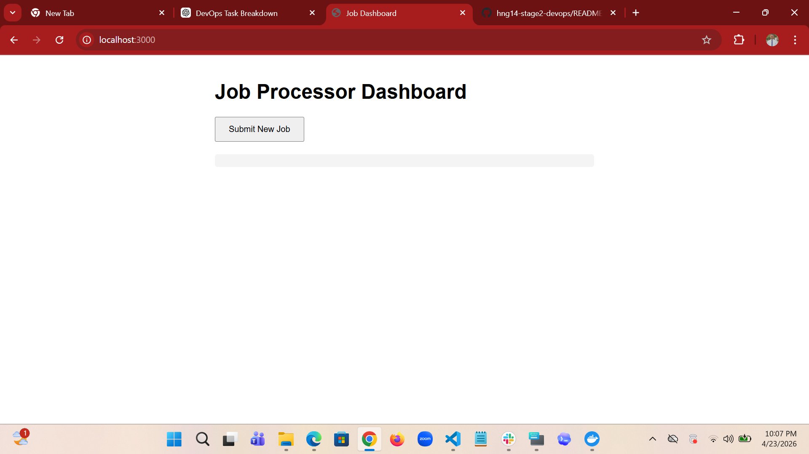
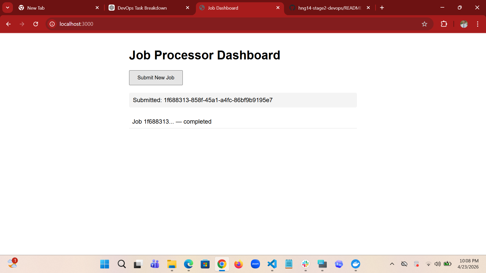

# 🚀 Stage 2 DevOps Task – Containerized Job Processor

## 📌 Project Overview

This project is a production-ready **containerized microservices job processing system** built as part of the **HNG Stage 2 DevOps Task**.

The objective was to audit, fix, optimize, and deploy a broken multi-service application using DevOps best practices.

The system allows users to submit jobs through a web dashboard, processes them asynchronously using a worker service, and tracks job completion in real-time.

---

## 🛠 Tech Stack

| Component | Technology |
|--------|------------|
| Frontend | Node.js + Express |
| Backend API | FastAPI |
| Worker Service | Python |
| Queue / Cache | Redis |
| Containerization | Docker |
| Orchestration | Docker Compose |

---

## 🏗 System Architecture

```text
User Browser
     ↓
Frontend Dashboard (Port 3000)
     ↓
FastAPI Backend (Port 8000)
     ↓
Redis Queue
     ↓
Python Worker Service

✨ Features
Submit background jobs from dashboard
Real-time job status updates
Redis-powered queue system
Multi-container microservices setup
Docker healthchecks enabled
Automatic service restart policies
Secure non-root containers
Environment variable configuration
Clean production-ready structure

📂 Project Structure
hng14-stage2-devops/
│── api/
│   ├── main.py
│   ├── requirements.txt
│   └── Dockerfile
│
│── frontend/
│   ├── app.js
│   ├── package.json
│   ├── views/
│   └── Dockerfile
│
│── worker/
│   ├── worker.py
│   ├── requirements.txt
│   └── Dockerfile
│
│── docker-compose.yml
│── .env.example
│── .gitignore
│── FIXES.md
│── README.md

Major Fixes Implemented
Backend API
Removed hardcoded Redis configuration
Added .env support
Added /health endpoint
Fixed invalid HTTP responses
Improved reliability
Worker Service
Removed unused imports
Added Redis reconnect logic
Added proper error handling
Improved job status tracking
Added healthcheck support
Frontend
Removed hardcoded API URLs
Added environment variable config
Added /health route
Improved logs & errors
Production Docker support
Infrastructure
Added Dockerfiles for all services
Added Docker Compose orchestration
Added .dockerignore
Added healthchecks
Added restart policies
Added resource limits
Improved security with non-root users
⚙️ Environment Variables

Create .env
REDIS_HOST=redis
REDIS_PORT=6379

API_PORT=8000
FRONTEND_PORT=3000

API_URL=http://api:8000

Running the Project
1️⃣ Clone Repository
git clone https://github.com/ntonous/hng14-stage2-devops.git
cd hng14-stage2-devops

2️⃣ Start Services
docker compose up --build -d

3️⃣ Verify Running Containers
docker compose ps

Expected:

frontend → healthy
api → healthy
worker → healthy
redis → healthy
🌐 Access Application
Frontend Dashboard
http://localhost:3000

API Health Check
http://localhost:8000/health

health
🧪 Testing Job Flow
Open Dashboard
Click Submit New Job
Worker processes task
Status becomes:
completed





🔒 Security Improvements
Containers run as non-root users
Environment variables externalized
Reduced image sizes with slim/alpine images
Health monitoring enabled
Safer production deployment setup

📈 DevOps Skills Demonstrated
Debugging broken applications
Docker image optimization
Multi-container orchestration
Service dependency management
Health monitoring
Production readiness
Environment management
Git workflow & documentation

📄 Deliverables Included
Source Code
Dockerfiles
Docker Compose
FIXES.md
README.md
GitHub Repository

👤 Author

Hezekiah Umoh

GitHub: https://github.com/ntonous

🎯 Final Note

This project demonstrates practical DevOps ability in transforming a flawed application into a clean, scalable, containerized production-ready system.